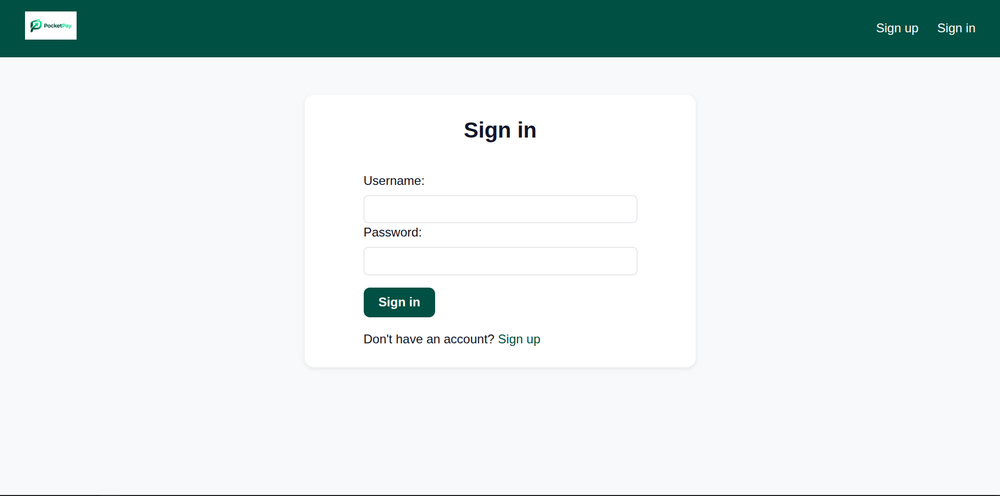
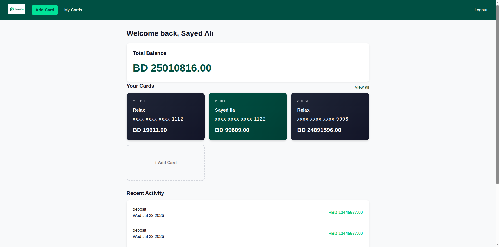
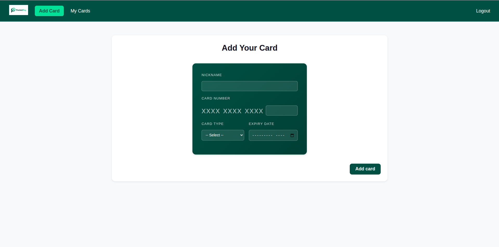
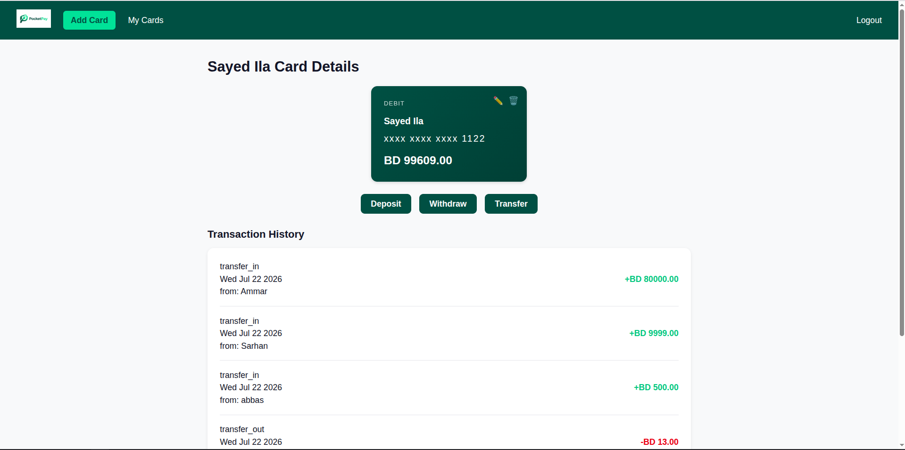
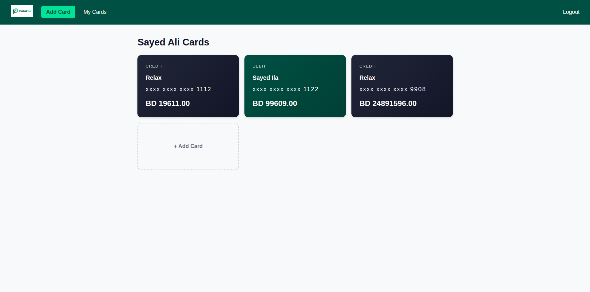
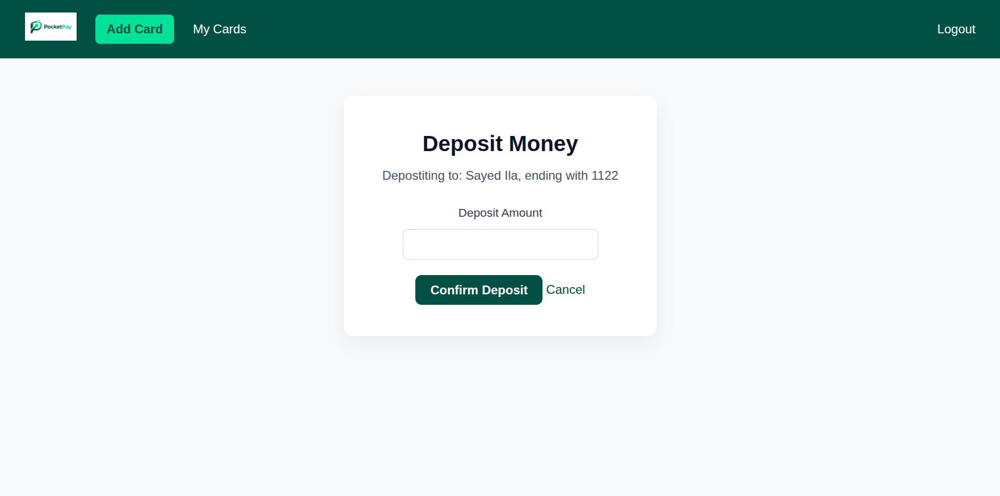
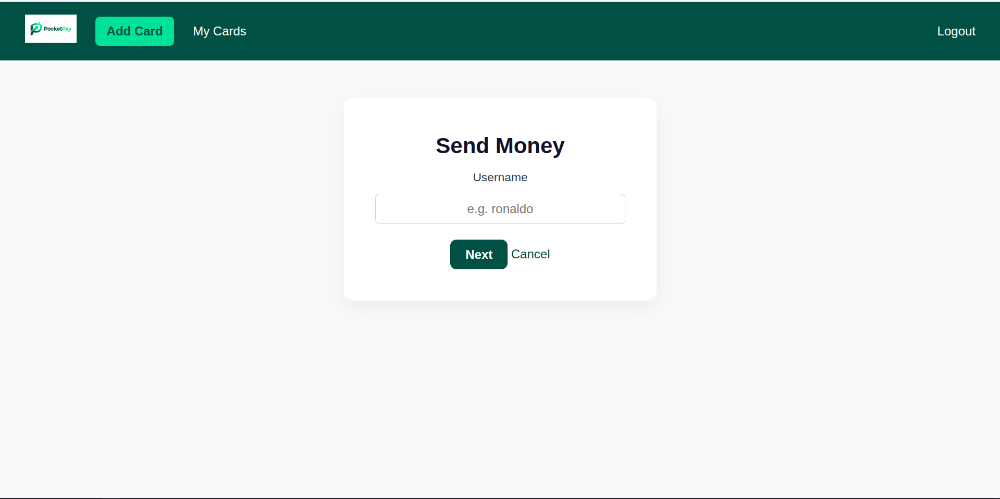
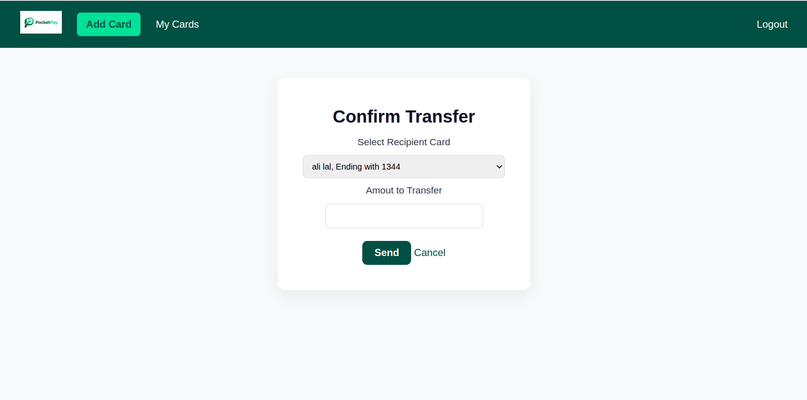
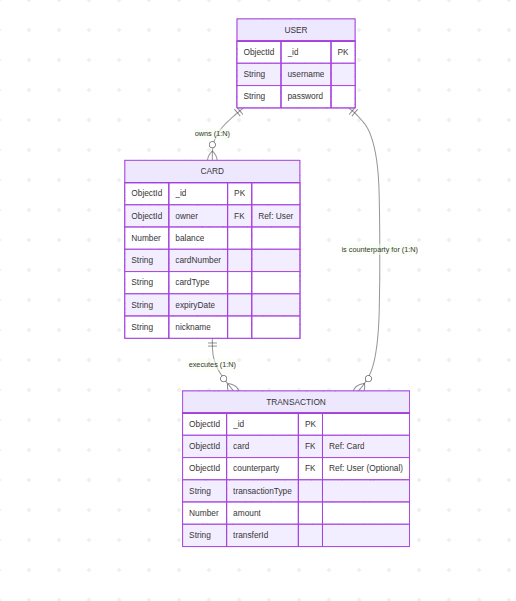

# PocketPay

## Overview

PocketPay is a full-stack, authenticated digital wallet application built with Node, Express, MongoDB, and EJS. Users can sign up, add multiple cards (debit or credit), and manage each card's balance through deposits, withdrawals, and peer-to-peer transfers to other users. Every balance change is backed by a permanent, append-only transaction record — nothing is ever edited or deleted from a card's history, mirroring how real financial ledgers work.

The app was built as a solo project combining full-stack CRUD fundamentals with fintech-inspired concepts: per-card balances (rather than a single account total), an audit-trail transaction model, and a two-step transfer flow between users.

## Screenshots



















## Technologies Used

- Node.js
- Express
- MongoDB / Mongoose
- EJS (Embedded JavaScript templating)
- bcrypt (password hashing)
- express-session (session-based authentication)
- CSS

## Getting Started

- [Deployed App](#) *https://pocketpay-ercr.onrender.com/*
- [Planning Materials / Trello Board](#) *(add your planning link)*
- [GitHub Repo](#) *(https://github.com/SAliMustafa/PocketPay)*

## Installation

1. Clone this repository
   ```
   git clone <your-repo-url>
   ```
2. Install dependencies
   ```
   npm install i
   ```
3. Create a `.env` file in the root directory with the following variables:
   ```
   MONGODB_URI=your_mongodb_connection_string
   SESSION_SECRET=your_session_secret
   PORT=3000
   ```
4. Start the server
   ```
   node server.js
   ```
5. Visit `http://localhost:3000` in your browser

## User Stories

- As a guest, I want to sign up for an account with a username and password, so that I can start using the app.
- As a guest, I want to log in with my username and password, so that I can access my cards and transaction history.
- As a logged-in user, I want to view my total balance (summed across all my cards) on my dashboard, so that I know how much money I have overall.
- As a logged-in user, I want to add a new card, so that I have a place to hold and manage a balance.
- As a logged-in user, I want to view, edit, and delete my cards, so that I can keep my funding sources and details up to date.
- As a logged-in user, I want to deposit money into a specific card, so that that card's balance increases.
- As a logged-in user, I want to withdraw money from a specific card, so that that card's balance decreases.
- As a logged-in user, I want to choose which of my cards to send money from when transferring to another user, so that I can control which balance is used.
- As a logged-in user, I want to view a full transaction history per card, so that I can track where each card's money has gone.
- As a logged-in user, I want to see the counterparty's username on transfer transactions, so that I know who I sent money to or received money from.

## Database Design

PocketPay uses three models with two one-to-many relationships:



## Routes

### Auth Routes

| Method | Route             | Description                        |
|--------|-------------------|-------------------------------------|
| GET    | /auth/sign-up     | Render sign-up form                 |
| POST   | /auth/sign-up     | Create new user, log them in        |
| GET    | /auth/sign-in     | Render sign-in form                 |
| POST   | /auth/sign-in     | Authenticate user, create session   |
| GET    | /auth/sign-out    | Log out user, destroy session       |

### Card Routes

| Method | Route                  | Description                                         |
|--------|------------------------|------------------------------------------------------|
| GET    | /card                  | Index — list all of the logged-in user's cards       |
| GET    | /card/new              | Render form to add a new card                        |
| POST   | /card                  | Create a new card                                    |
| GET    | /card/:cardId          | Show a single card's details + its transaction history |
| GET    | /card/:cardId/edit     | Render form to edit a card (nickname, expiry only)   |
| POST   | /card/:cardId/edit     | Update a card's editable details                     |
| POST   | /card/:cardId/delete   | Delete a card                                        |

### Transaction Routes

| Method | Route                                          | Description                                          |
|--------|-------------------------------------------------|--------------------------------------------------------|
| GET    | /card/:cardId/transaction/new-deposit          | Render form to deposit into a card                    |
| POST   | /card/:cardId/transaction/deposit              | Create a deposit transaction, increase card balance    |
| GET    | /card/:cardId/transaction/new-withdrawal       | Render form to withdraw from a card                   |
| POST   | /card/:cardId/transaction/withdrawal           | Create a withdrawal transaction, decrease card balance |
| GET    | /card/:cardId/transaction/new-transfer         | Render form to look up a transfer recipient            |
| POST   | /card/:cardId/transaction/new-transfer         | Look up recipient, render card selection confirmation  |
| POST   | /card/:cardId/transaction/transfer             | Execute transfer: debit sender, credit recipient, log both transactions |

## Features

- Session-based authentication with hashed passwords
- Full CRUD on Cards (create, read, update, delete), with server-side ownership checks on every route
- Cards restricted to `debit` or `credit` type via schema-level validation
- Deposit and withdrawal flows with balance validation (no overdrawing a card)
- Two-step peer-to-peer transfer flow: look up recipient by username, select which of their cards receives the funds, then confirm the amount
- Append-only transaction ledger per card, including linked transfer pairs via a shared `transferId`
- Dashboard homepage showing total balance across all cards, a card overview, and recent activity
- Custom-styled UI with a consistent emerald/mint color palette, distinct visual themes for debit vs. credit cards, and card-shaped forms

## Future Enhancements

- Currency conversion display using a live exchange rate API
- Recurring/scheduled transfers
- Spending breakdown and analytics by category
- Email-based password recovery

## Credits

- Icons: emoji-based icons used for quick in-app actions (edit/delete)
- Built as part of a General Assembly Software Engineering Immersive project